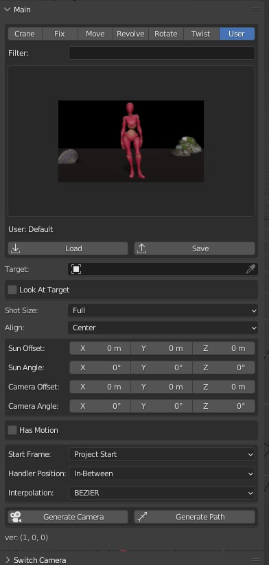
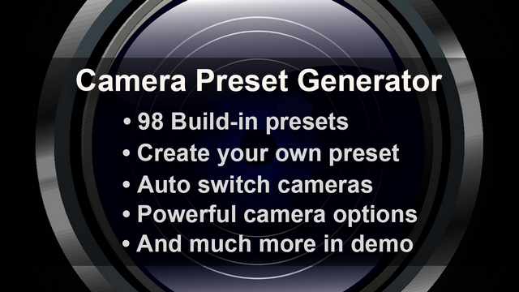
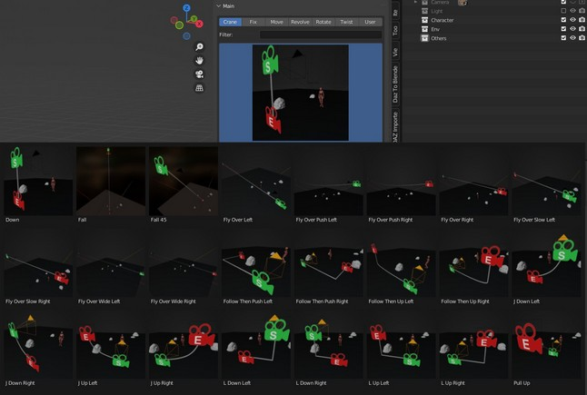

# Blender 扩展 Camera Preset Generator [镜头模板生成器]
本扩展提供98个带有缩略图和演示视频的镜头模板，并可以创建自己的模板。  

同时，扩展提供强大的摄影机系统和选项，还可以自动在多个镜头之间进行切换。  

# 截图
扩展  
  

# 演示视频
[https://youtu.be/GCwKTui4vpM](https://youtu.be/GCwKTui4vpM)  
b站：  
[https://www.bilibili.com/video/BV1zX4y1k7EK/](https://www.bilibili.com/video/BV1zX4y1k7EK/)  

  

# 内置模板预览
下面的`.zip`文件中，包含所有内置镜头模板的预览图和演示视频:  

mega:  
[https://mega.nz/file/VzZ1DSoC#x4lLAIqg5kYMEMEfM2jktFIcYZeYeSkA2fbxGRf7Ogk](https://mega.nz/file/VzZ1DSoC#x4lLAIqg5kYMEMEfM2jktFIcYZeYeSkA2fbxGRf7Ogk)  

mediafire:  
[https://www.mediafire.com/file/fbcbpns5kw1pqiy/preset_v1.0.0.zip/file](https://www.mediafire.com/file/fbcbpns5kw1pqiy/preset_v1.0.0.zip/file)  

  

# 信息
### 下载
爱发电：
[https://afdian.net/item/dd3b5de6d35811edac5952540025c377](https://afdian.net/item/dd3b5de6d35811edac5952540025c377)  
爱发电便宜4元。购买后会收到站内信，里面是网盘下载地址。所以先注册再购买。  

Blender 市场:  
[https://blendermarket.com/products/camera-preset-generator](https://blendermarket.com/products/camera-preset-generator)  

**注意，该扩展面向有经验的Blender用户。为防止Blender新手购买，本扩展不提供中文版**  

### Github
Github项目池只用于文档和交流，不含有代码。      
[https://github.com/butaixianran/Blender-Camera-Preset-Generator](https://github.com/butaixianran/Blender-Camera-Preset-Generator)  

### 版本
扩展: 1.2.0  
Blender: 3.0 或以上

# 功能
* **一键创建完善摄影机系统**  
  
* **选择带有预览图的模板，来创建镜头运动**  
  
* **98个内置镜头模板**  
* **内置模板带有演示视频**  

https://user-images.githubusercontent.com/5558722/170871970-07381273-c618-4814-98d0-ec0bbecc7e5a.mp4

* **可根据多个关键字，搜索多个分类中的模板**  
  

* **在创建镜头之前，可先通过选项调整镜头**  
* **自动切换生成的所有摄影机，合并成连流畅的镜头动画**  
  
* **保存自己的镜头模板**  
* **调整或创建镜头分类**  
  
* **一键创建带有摄影机运动轨迹的模板缩略图**  
  

# 安装
* 安装你获得的`.zip`文件
* 在扩展列表中搜索"`Camera Preset Generator`"
* 在3D视图区域，按下N显示工具面板，从中选择"`Cam Preset Gen`"面板

如果不清楚怎么安装Blender扩展，请搜索: "blender 扩展安装"。  

# 使用方法
## 创建摄影机运动
* 选择分类，选择模板，点击"`Generate Camera`" 按钮.
* 可以在Filter中输入关键词搜索模板，支持多个关键词

## 自动切换相机
* 先用本扩展生成多个摄像机  
* 点击扩展底部的"`Auto Switch Camera`"按钮.  

自动切换相机，只对本扩展生成的镜头系统有效。你可以手动移动或旋转镜头系统中的任何物体，依然可以自动切换。但是不要修改镜头系统中物体的父子关系。  

## 创建模板
* 点击保存按钮即可  

## 创建模板缩略图
* 点击扩展底部的"`Generate Path`"按钮，就会生成摄影机路径。
* 前往3D视图区域顶部的"`View`"菜单，选择"**Viewport Render Image**"菜单项目，把这个镜头路径渲染成图片
* 保存渲染的图片，到模板文件夹，并使用和模板文件相同的文件名主体，就可以作为预览图了。

## 读取模板
* 使用"`Load`"按钮读取模板时，可以直接选择预览图来导入对应模板。  

## 修改分类或往分类添加模板
* 前往本扩展安装路径中的模板目录
  * 对于windows，默认是："`%AppData%\Blender Foundation\Blender\你的Blender版本\scripts\addons\CameraPresetGenerator\preset`"
* 其中的任何目录，都将成为一个模板分类
* 一个分类目录下的任何模板文件，都将被显示在模板预览列表中

# 常用技巧
### 基本
* "`User`"模板分类中，有个默认模板，可以用来重置扩展面板上的选项。 

* 可通过面板上显示的模板名称，来得知当前选中的是哪个模板   

* 选择一个和你需要的镜头接近的模板，然后手动进行调整，能以最快速度得到你想要的镜头。只有当你需要创建新模板的时候，才去扩展面板调整参数。  

### 创建缩略图
* Blender的缩略图，需要是方形图片，效果才比较好
* 如果模板没有缩略图，扩展会在模板列表中显示一张默认图片。因此你实际上并不是必须自己创建缩略图  

# 镜头系统
本扩展会创建一个包含以下内容的镜头系统：一个摄影机，一个目标[空对象]，一个公转太阳[空对象]，一个整个相机系统的父亲控制器  
  

* **摄影机:** 可以随意移动或旋转  

* **公转太阳:** 旋转它，相机就会绕着它旋转  

* **目标空对象:** 如果面板上勾选了"`Look at target`"[看向目标]，并且`Target Type`[目标类型]设为"`Empty`"[空对象]，那么，摄影机就会一直看向这个目标空对象   
  * **当镜头需要跟踪一个一直在震动的运动过物体时（比如，颠簸的车辆或跑动的角色），镜头又需要保持稳定的话，这个目标空对象，就非常有用**    

* **控制器:** 整个系统的父亲空对象。这样你就能够整体调整摄像机系统。  

https://user-images.githubusercontent.com/5558722/170872071-907755d7-c154-485f-b93b-35db93e6d67a.mp4

# 选项
### 位置和旋转
一个生成的镜头，可以包含3个关键帧：
* **起始帧**  
扩展面板上的向量选项，不是座标和最终角度。而是基于"**默认状态**"的移动距离和旋转角度。  

* **结束帧**: 当勾选"`Has Motion`"[是运动镜头]后可用.  
扩展面板上的向量选项，不是座标和最终角度。而是基于"**起始帧**"的移动距离和旋转角度。  

* **中点帧**: 当勾选"`Set Middle Point`"[设置中点]后可用.  
扩展面板上的向量选项，不是中点的座标和最终角度。而是基于"**起始帧**"的移动距离和旋转角度。  

### 镜头长度
单位是秒，会根据项目的fps设置，自动转换为帧数  

请注意，如果使用CC人模，导入人模后，项目会自动变成60帧每秒。  

### Look At Target Type
如果勾选了"`Look At Target`"[看向目标]，生成的相机将会看向你在本选项选择的目标：  
* **空**: 摄像机系统生成的目标空对象，它的起始位置，和公转太阳的起始位置一致。
* **物体**: 你在"`Target`"[目标]属性中选择的物体。如果勾选了"`Target Bone`"[骨骼作为目标]，那么选择的骨骼，就是镜头看向的目标  

### 控制器位置:
用来设置镜头系统的父亲控制器的出生位置，默认是`In-Between`[中间]，意思是，它会在相机和公转太阳的中间。  

### 自动切换镜头
一般来说，切换点是每一个镜头运动的最后一帧。  

摄像机的排序方式，是按照摄像机运动的起始帧排序。  

比如，你有如下摄像机：  
摄像机01，运动起始帧是： 100-300  
摄像机01，运动起始帧是： 600-900  

那么，摄像机自动切换后，将从摄像机01开始。并在第300帧切换到摄像机02。但是，摄像机02在第300帧并没有运动，直到你播放到第600帧。  

所以，设置多个摄像机，你一样需要设置每个摄像机运动的起始帧位置。这和一般创建摄影机运动是一样的。  

不过，模板预设，已经帮你设好了摄像机运动长度，所以，你只需要选个起始帧就可以了。  

只需要在扩展面板上，设置"**Start frame**"选项为"**current frame**"(当前帧)，然后去你想要设为起点的帧，生成摄影机即可。  

你也可以设置设置"**Start frame**"选项为"**Follow Last Camera**"(紧跟最后一个摄影机)，这样，新生成的相机起始帧，就会跟在最后一个镜头运动的后面。  

如果你有很多个摄影机，你可能会搞不清楚每个镜头运动起始和结束范围在哪里。你可以去Blender的NLA，一次查看所有镜头的位置。就像看视频剪辑软件里的剪辑块。  

但是，不要按"Push Down Action"按钮。一旦你真的把摄像机的Action，都变成剪辑块strip，自动切换摄影机就会失效了，因为无法从action获取镜头关键帧位置了。  

#### 切换方法
2种切换方法，基于对固定镜头的不同处理方式。   
固定镜头是指，只有起始帧，没有结束帧的镜头。  

对于**merge**方法, 如果一个镜头是固定镜头，那么下一个镜头的起始帧的帧数，将作为镜头切换点的帧数。这样，这个固定镜头，就被合并到镜头运动中去了。   

对于**follow**方法, 如果一个镜头是固定镜头，就会使用你在扩展面板上设置的"**fixed shot duration**"（固定镜头持续时间），来计算这个固定镜头的结束帧帧数。然后用这个计算出来的帧数，作为下一个镜头的切换点。   

# 支持的格式
## 文件后缀
* 预设: `.cpg`  
* 预设缩略图: `.jpg`, `.png`, `.bmp`, `.tiff`  
* 预设演示视频: `.mp4`, `.mov`, `.avi`  

## 文件名
* 预设缩略图: `模板主文件名.cpg.jpg` 或者 `模板主文件名.jpg`  
* 预设演示视频: `模板主文件名.cpg.mp4` 或者 `模板主文件名.mp4`  

## 模板内容
是个json文本文件。  

# 更新Log
## 1.3.0
* 支持Blender 5.x
* 从Blender 5开始，Action下面多了一层Slot。本扩展只处理第一个Slot

## 1.2.0
* 添加"保持目标"选项，可以避免从模板读取目标设置，从而保持面板上的目标不变

## 1.1.0
* 修改所有模板的起始帧设置为：当前帧
* 修改默认的起始帧设置，从"项目起点" 改为 当前帧
* 添加"Follow Last Camera"（紧跟最后一个摄影机） 到"镜头起始帧"选项
* 现在起，"镜头起始帧"选项，不会在读取模板时发生改变了

