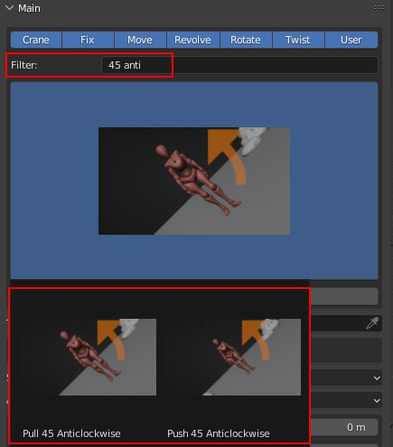

# Language
[中文](README.cn.md)  

# Blender Addon Camera Preset Generator
This addon offers **98 camera motion presets with thumbnail image and demo video**. It also can **auto switch multiple cameras** easily.   

You can also **adjust or save your own preset**, and create **a useful thumbnail image which draws camera path on it with one click**.  

# Screenshot
Addon  
  

# Demo Video
    
[https://youtu.be/GCwKTui4vpM](https://youtu.be/GCwKTui4vpM)  
  

# Build-in Presets Preview
All presets' thumbnail images and demo videos are included in following `.zip` file:  

mega:  
[https://mega.nz/file/VzZ1DSoC#x4lLAIqg5kYMEMEfM2jktFIcYZeYeSkA2fbxGRf7Ogk](https://mega.nz/file/VzZ1DSoC#x4lLAIqg5kYMEMEfM2jktFIcYZeYeSkA2fbxGRf7Ogk)  

mediafire:  
[https://www.mediafire.com/file/fbcbpns5kw1pqiy/preset_v1.0.0.zip/file](https://www.mediafire.com/file/fbcbpns5kw1pqiy/preset_v1.0.0.zip/file)  

  

# Info
### Download
Blender Market:  
[Link will be here]

### Github
Github repo is for document and issues. There is no code in it.  
[https://github.com/butaixianran/Blender-Camera-Preset-Generator](https://github.com/butaixianran/Blender-Camera-Preset-Generator)  

### Version
Addon: 1.0.0   
Blender: 3.0 or later  

# Feature
* **Create a handy camera system with 1 click**  
  
* **Create a camera shot from a preset**  
  
* **98 build-in camera presets**  
* **Demo video for build-in presets.**  

https://user-images.githubusercontent.com/5558722/170871970-07381273-c618-4814-98d0-ec0bbecc7e5a.mp4

* **Search presets in multiple categories with multiple keywords.**  
  

* **Adjust camera preset before bringing it into scene.**  
* **Auto switch all cameras into a smooth animation**  
  
* **Save you own camera preset**  
* **Adjust or create preset category.**  
  
* **Create a useful preset thumbnail image which draws camera path in it with 1 click.**  
  

# Install
* Install the .zip file you get from online shop.
* Search "`Camera Preset Generator`" in your addon list and enable it
* In viewport, press "`N`" to display tool panels, select "`Cam Preset Gen`" panel

If you are new to blender and don't know how to install a blender addon, search: "blender install addon" in google.  

# How to use
## Create Camera Motion
* Select a category, pick a preset, click "`Generate Camera`" button.
* You can search presets with filter, supporting multiple keywords

## Auto Switch Camera
* Generate multiple cameras with this addon.  
* Click "`Auto Switch Camera`" button at the bottom of this addon's panel.  

Auto Switch only works for camera systems generated by this addon. You can manually move or rotate any items of a camera system, it will still work. Just do not change a camera system's structure.  

## Create preset
* Click Save button.  

## Create preset thumbnail image
* Click "`Generate Path`" button at the bottom of this addon. It will generate a path of your camera.
* Go to "`View`" menu at the top of viewport, select "**Viewport Render Image**", render this camera path into an image.
* Save this image with the same name of your preset, into the same folder. 

## Load Preset
* When using "`Load`" button, You can pick thumbnail image to load a preset.  

## Modify Category or add preset to Category
* Go to addon's preset folder
  * on windows, it could be: "`%AppData%\Blender Foundation\Blender\Your Blender Version\scripts\addons\CameraPresetGenerator\preset`"
* Any folder here, will be load as a category.
* Any preset file in a category folder, will be displayed in the preview list

# Tip
### General
* There is a default preset in "`User`" category. You can use it to reset addon panel's setting.  

* Check preset's name on addon panel, to know which preset you selected.   

* Choose a preset similar to the shot you want, then move it manually, can achieve the shot you need most efficiently. Only adjust settings on addon panel when you need your own preset.  

### Create thumbnail image
* Blender's preview image works best with square ratio.
* If a preset doesn't have a thumbnail image, addon will use a default image. So you actually don't have to create a thumbnail image.  

# Camera System
This addon creates a camera system with: a Camera, a Target, a Revolve Sun, and a Handler for the whole system.  
  

* **Camera:** you can move or rotate it as you want  

* **Revolve Sun:** rotate it, camera will rotate around it.  

* **Empty Target:** If "`Look at target`" is checked and `Target Type` is set to "`Empty`" on addon panel, camera will always look at this empty target.   
  * **This is very useful, when you want to track a moving object which keeps shaking, but you still want to keep your camera stable.**    

* **Handler:** Empty parent for the whole system. So you can adjust camera motion as a whole.  

https://user-images.githubusercontent.com/5558722/170872071-907755d7-c154-485f-b93b-35db93e6d67a.mp4

# Setting
### Position and Rotation
A generated camera motion can have 3 key frames:
* **Start frame**  
Those vector properties on addon panel are not coordinates and final angles. They are distance and rotation angles about how much you want to move or rotate it based on **default transform**.  

* **End frame**: Can be set after checking "`Has Motion`".  
Those vector properties on addon panel are not coordinates and final angles. They are distance and rotation angles about how much you want to move or rotate it based on **start frame**.  

* **Middle frame**: Can be set after checking "`Set Middle Point`".  
Those vector properties on addon panel are not coordinates and final angles. They are distance and rotation angles about how much you want to move or rotate it based on **start frame**.  

### Shot Duration
Unit is second, will be converted into frame numbers based on project's fps setting.  

### Look At Target Type
If "`Look At Target`" is checked, generated camera will always looking at the target object you selected here:  
* **Empty**: Generated empty target object, whose start position is same as empty sun.
* **Object**: The object you picked into "`Target`" property. If "`Target Bone`" is checked, the bone you selected will be the target to look at.  

### Handler Position:
Set position of camera system's handler. Default is `In-Between`, means it is at the middle of the camera and the empty sun object.  

# Format
## File Ext
* Preset: `.cpg`  
* Thumbnail image: `.jpg`, `.png`, `.bmp`, `.tiff`  
* Demo video: `.mp4`, `.mov`, `.avi`  

## File Name
* Thumbnail image: `preset_base_name.cpg.jpg` or `preset_base_name.jpg`  
* demo video: `preset_base_name.cpg.mp4` or `preset_base_name.mp4`  

## Preset Content
A text json file.  

